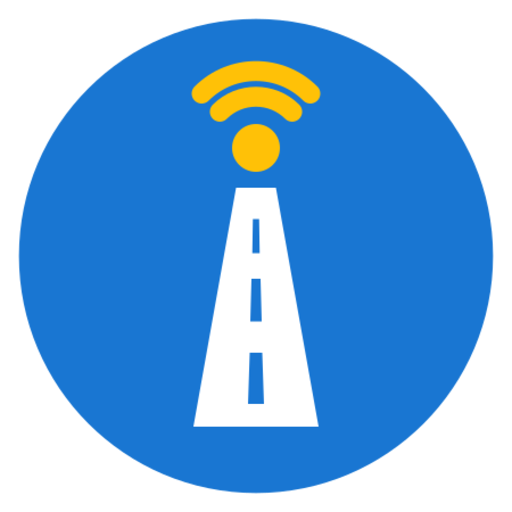
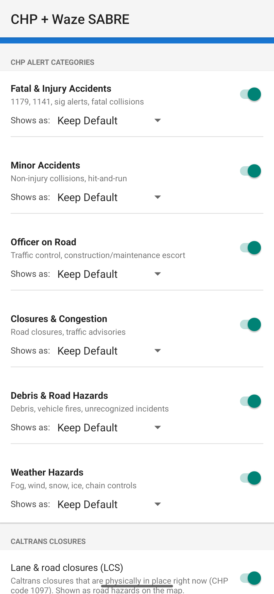
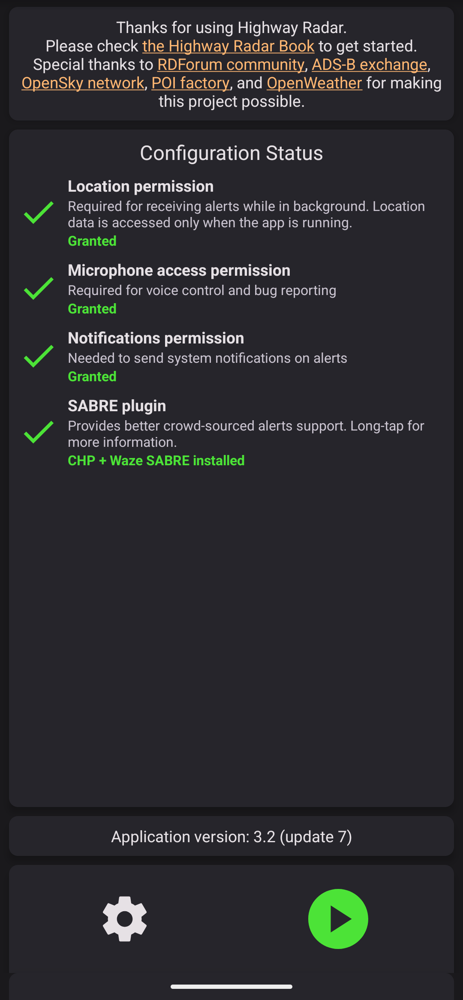
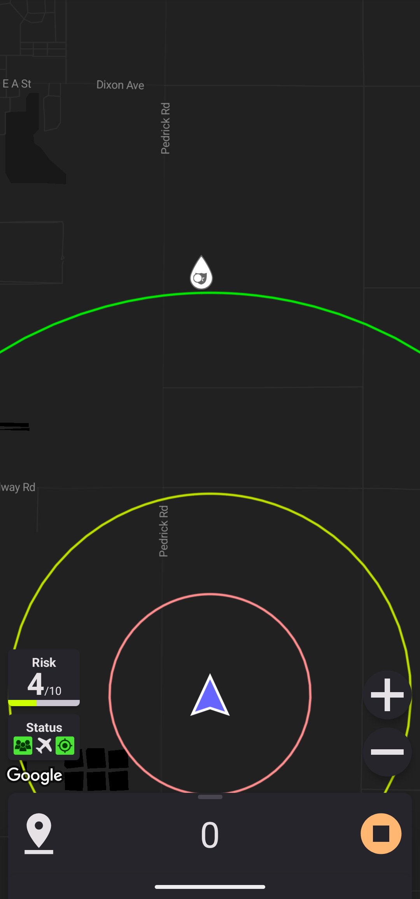

# CHP + Waze SABRE for Highway Radar



[](https://github.com/nicglazkov/highway-radar-sabre-plus/actions/workflows/ci.yml)
[](https://github.com/nicglazkov/highway-radar-sabre-plus/releases/latest)
[](https://github.com/nicglazkov/highway-radar-sabre-plus/releases)
[](LICENSE)
[](#requirements)

An open-source **Highway Radar SABRE plugin** for California, and a drop-in **wzsabre** replacement: it brings live CHP incidents, Waze crowdsourced alerts, Caltrans lane closures, active wildfires, and winter chain controls to [Highway Radar](https://www.highwayradar.com/) via the SABRE plugin protocol.

> **Package ID: `app.sabre.wzsabre`** (the same as wzsabre), so Highway Radar discovers this plugin automatically without any reconfiguration.

---

## What it does

| Source | Data | Update cadence |
|--------|------|----------------|
| **CHP Live Feed** | Accidents, road closures, debris, officer on road, weather hazards, directly from the California Highway Patrol statewide XML feed | Every HR map refresh |
| **Waze** | Crowdsourced police, accidents, hazards, road closures | Every HR map refresh |
| **Caltrans Closures (LCS)** | Lane and road closures that are physically in place right now (CHP code 1097), from the per-district Caltrans Lane Closure System feeds | Cached, refreshed every 5 min |
| **Wildfires** | Active California wildfires (name, size, containment) from the interagency WFIGS feed, shown as road hazards near the fire | Cached, refreshed every 5 min |
| **Chain Controls** | Caltrans winter chain requirements (R-1/R-2/R-3) on mountain routes, shown as slippery-road hazards | Cached, refreshed every 5 min |

All sources run in parallel and feed into the standard HR crowdsourced-alerts layer, the same map overlay that wzsabre used to power.

---

## Screenshots

| Plugin settings | Detected by Highway Radar | Alerts on the HR map |
|:---:|:---:|:---:|
|  |  |  |
| Per-category toggles and "shows as" overrides. | Highway Radar auto-discovers the plugin. | CHP / Waze / Caltrans alerts on the map. |

---

## Requirements

- Android **7.0+** (API 24)
- [Highway Radar](https://play.google.com/store/apps/details?id=com.highwayradar.app) installed
- Sideloading enabled on your device

---

## Installation

### Option A: Download the APK (recommended for most users)

1. Go to the [Releases](../../releases) page and download the latest APK.
2. On your Android device, open **Settings → Security** (or *Install unknown apps*) and allow installs from your browser or file manager. If Google Play Protect warns that the app is unrecognized, tap **More details → Install anyway**.
3. Open the downloaded APK and tap **Install**.
4. Open the **CHP + Waze SABRE** app once. On first launch, **allow notifications** and **allow the battery-optimization exemption** when prompted, without these the background service can be frozen and alerts stop.
5. Open **Highway Radar → Settings → SABRE** and select **CHP + Waze SABRE**.

> **Why the persistent notification?** Android requires a foreground-service notification while the plugin is feeding alerts. The plugin only runs while Highway Radar is open and stops itself shortly after you close HR, so it isn't running (or notifying) in the background the rest of the time.

> **After a phone reboot:** Just open Highway Radar, the plugin starts automatically when HR sends its first request.

### Option B: Auto-update with Obtainium

For hands-off updates, install via [Obtainium](https://github.com/ImranR98/Obtainium): add this repo's URL (`https://github.com/nicglazkov/highway-radar-sabre-plus`) as an app source and Obtainium will check GitHub Releases and install new versions for you. (The app also shows an in-app banner and a one-time notification when an update is available.)

### Option C: Build from source

See [BUILDING.md](BUILDING.md).

---

## Configuration

Open the **CHP + Waze SABRE** app to access settings. All changes take effect immediately on the next HR map refresh, no restart needed.

### Alert Categories

Each CHP category has two controls:

- **Toggle (on/off)**: disabled categories are never sent to HR.
- **"Shows as" picker**: controls which Highway Radar icon is used for that category.

| Category | Default HR icon | What it covers |
|----------|----------------|----------------|
| Fatal & Injury Accidents | Accident (Major) | 1179, 1183, fatals, SIG alerts |
| Minor Accidents | Accident (Minor) | Non-injury collisions, hit-and-run |
| Officer on Road | Police Visible | Traffic control, construction escorts |
| Closures & Congestion | Road Closure | Road closures, traffic advisories |
| Debris & Road Hazards | Road Debris | Debris, vehicle fires, misc. hazards |
| Weather Hazards | *Natural* | Fog, wind, snow, ice, chain controls |

**Tip:** If you find the police icon distracting, set *Officer on Road → Shows as → Road Closure* to get a neutral congestion icon instead.

### Incident Age

Drops CHP alerts older than a configurable threshold using the incident's actual `LogTime` from the feed (not the time your phone fetched it). This prevents stale multi-hour incidents from cluttering the map.

Options: **No limit / 30 min / 1 hr / 2 hr / 4 hr / 8 hr** (default: 1 hour)

---

## Migrating from wzsabre

If you already have wzsabre installed:

1. **Uninstall wzsabre** (Settings → Apps → wzsabre → Uninstall).
2. Install this APK, it uses the same package ID (`app.sabre.wzsabre`) so HR picks it up without any changes to HR's settings.
3. Open the new app once to start the service.

> The package ID being identical to wzsabre is intentional: HR's plugin discovery whitelists `app.sabre.wzsabre`, and we reuse it so no HR-side changes are needed.

---

## Troubleshooting

**"Crowd-Sourced Alert Problems" banner in HR**
- Open the CHP + Waze SABRE app and check that the service status shows *"Plugin active"*.
- Tap the green start button in HR, this sends a fresh handshake.
- On Android 15: open this app first, then HR. The background service must be running before HR requests data.

**CHP alerts visible but no Waze alerts**
- Waze requires a real internet connection. On the very first use the plugin registers an anonymous Waze session in the background; Waze alerts can take ~10–20 seconds to appear that first time. After that the session and a live alert cache are kept warm and pre-loaded at start, so alerts appear within a second or two on subsequent sessions.
- Check that the app has network permission (it should request none explicitly; all network access is in the background service).

**No alerts at all**
- Confirm HR is using the correct plugin: HR → Settings → SABRE → should show "CHP + Waze SABRE".
- Check that no alert categories are all turned off in the app settings.

---

## How it works (brief)

```
Highway Radar  ──broadcast──▶  MainBroadcastReceiver
                                      │
                        startForegroundService()
                          (+ exact-alarm fallback)
                                      │
                               SabreService (foreground)
                              ┌───────┼─────────┐
                          CHP feed   Waze    Caltrans LCS
                          (XML)     (mobile  (per-district
                                    "RT"      closure XML,
                                    protocol, cached)
                                    protobuf)
                              └───────┼─────────┘
                               sendBroadcast(response)
                                      │
                               Highway Radar  ◀──────
```

- **CHP**: fetches `https://media.chp.ca.gov/sa_xml/sa.xml`, filters by radius and incident age, applies your category settings.
- **Waze**: emulates the Waze mobile app's binary "RT" protocol. It registers an anonymous Waze session, logs in, and queries crowd-sourced alerts over Waze's protobuf API (the older live-map/georss API is now blocked). The RT feed is session-stateful (each alert is sent once, then removed when it clears), so query results are merged into a persistent alert cache rather than replacing it, this keeps alerts from disappearing as you drive. A series of progressively smaller map viewports is queried so the server doesn't thin out minor alerts near you, the session is pre-warmed at start to cut first-load latency, and Waze alert subtypes (e.g. *car stopped on shoulder*, *heavy traffic*) are passed through to Highway Radar verbatim rather than flattened.
- **Caltrans LCS**: fetches the per-district lane-closure feeds (`https://cwwp2.dot.ca.gov/data/d<N>/lcs/lcsStatusD<NN>.xml`) for whichever districts cover your location. Only closures that are physically established (CHP code 1097 set, not picked up or canceled) are shown; shoulder-only closures are skipped. Closures longer than 2 km get a pin at each end. The ~4 MB feeds are parsed in the background and cached for 5 minutes, so they never delay a Highway Radar request.
- **Wildfires**: active California wildfires from the interagency WFIGS "Current Wildland Fire Incident Locations" feed (NIFC-hosted ArcGIS), filtered to active wildfires in California. Each is shown as a road hazard at the fire's location with its name, size, and containment. Background-cached like the other sources. Optional minimum-size filter in settings.
- **Chain controls**: Caltrans winter chain-control status from the per-district CWWP feeds (`https://cwwp2.dot.ca.gov/data/d<N>/cc/ccStatusD<NN>.xml`). Records at level R-1/R-2/R-3 (in service) are shown as slippery-road hazards; off-season the feed is all R-0 so nothing shows.
- **SABRE protocol**: a broadcast-intent IPC protocol defined by Highway Radar. Our plugin responds to `FETCH_REQUEST` broadcasts with a JSON payload containing `SabreFetchResponseAlert` objects.

---

## Contributing

Pull requests welcome. Run the test suite before submitting:

```bash
./gradlew test
```

228 unit tests cover the SABRE response format, alert type mapping (incl. Waze category filters), the Waze alert cache (delta merge + soft-delete), in-band Waze error classification, shrinking-box geometry, crowd-confirmation tracking, CHP XML parsing, Caltrans LCS and chain-control parsing and filtering, wildfire (WFIGS) parsing, cross-source de-duplication, the update-check version compare, config filtering, and LogTime parsing. See [BUILDING.md](BUILDING.md) for full dev setup, and [CHANGELOG.md](CHANGELOG.md) for release history.

---

## Disclaimer

This is an independent, unofficial project. It is **not affiliated with, endorsed by, or supported by** Waze, Google, the California Highway Patrol, Caltrans, or Highway Radar.

- The **Waze** integration works by emulating Waze's private, undocumented mobile protocol using an anonymous session. This may break at any time if Waze changes their protocol, and it may be contrary to Waze's Terms of Service. Use it at your own risk.
- The **CHP** and **Caltrans** data comes from public government feeds and is provided without any guarantee of accuracy, completeness, or timeliness.
- This app is provided for personal and educational use, **as-is and without warranty of any kind**. Do not rely on it for safety-critical decisions; always follow real-world road conditions, signage, and the law.

---

## License

[MIT](LICENSE)
