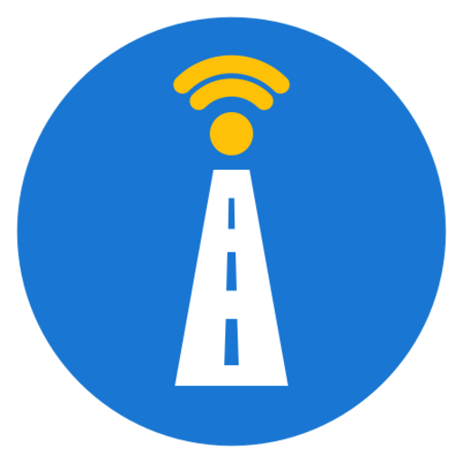
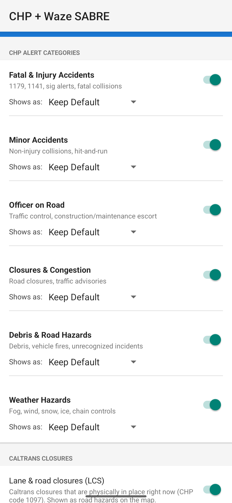
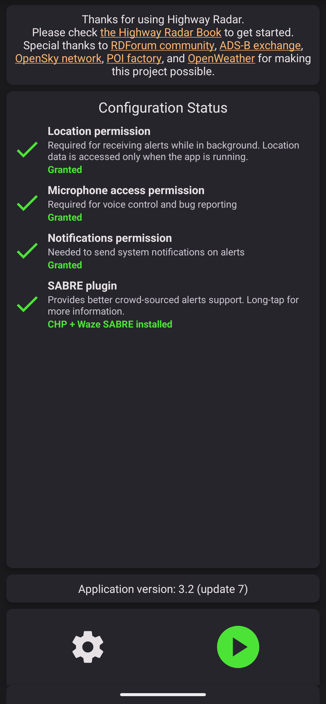
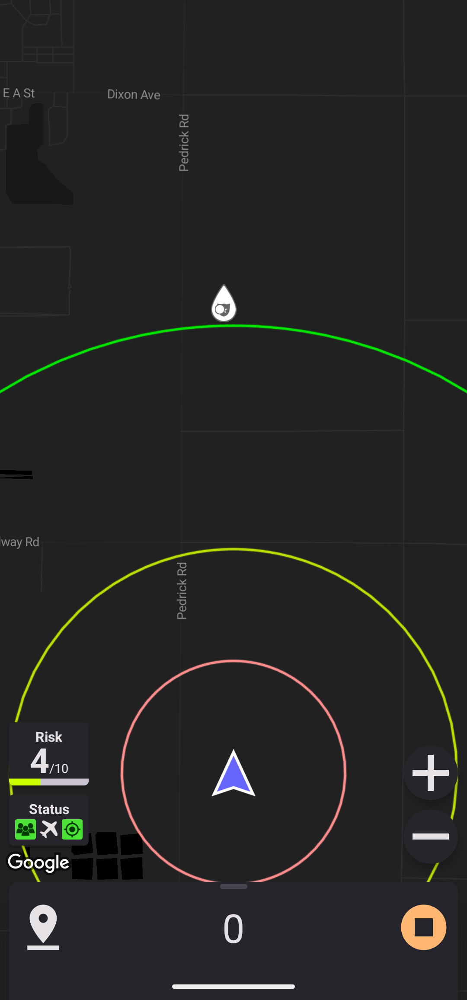
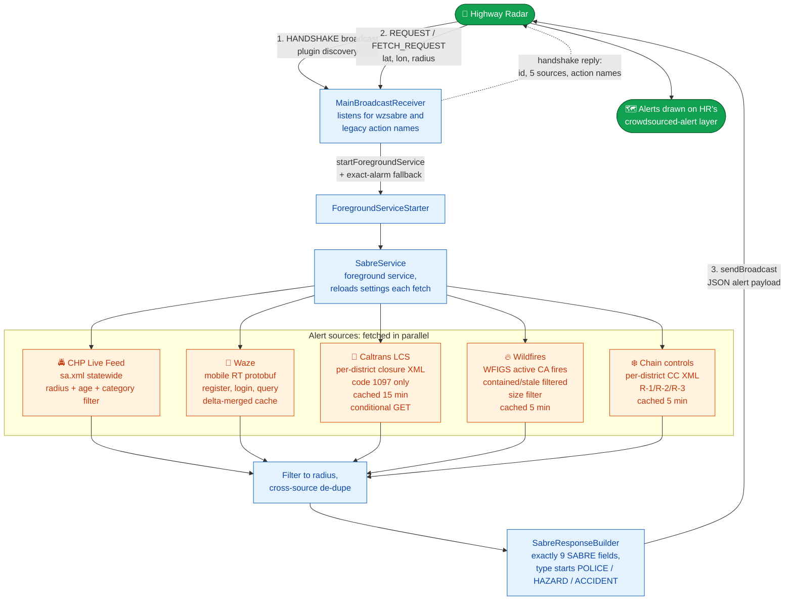

# SABRE Plus for Highway Radar



[](https://github.com/nicglazkov/highway-radar-sabre-plus/actions/workflows/ci.yml)
[](https://github.com/nicglazkov/highway-radar-sabre-plus/releases/latest)
[](https://github.com/nicglazkov/highway-radar-sabre-plus/releases)
[](LICENSE)
[](#requirements)

**Website: [nicglazkov.github.io/highway-radar-sabre-plus](https://nicglazkov.github.io/highway-radar-sabre-plus/)**

An open-source **Highway Radar SABRE plugin** for California, and a drop-in **wzsabre** replacement: it brings live CHP incidents, Waze crowdsourced alerts, Caltrans lane closures, active wildfires, and winter chain controls to [Highway Radar](https://www.highwayradar.com/) via the SABRE plugin protocol.

> **Package ID: `app.sabre.wzsabre`** (the same as wzsabre), so Highway Radar discovers this plugin automatically without any reconfiguration.

> ### Switching from wzsabre? One quick step first
>
> SABRE Plus is the new home for what wzsabre used to do, and Android only lets **one of them** be installed at a time (they share the plugin ID that Highway Radar looks for). So if the old **wzsabre** app is on your phone:
>
> 1. **Uninstall wzsabre** (long-press its icon, then App info, then Uninstall)
> 2. **Install SABRE Plus** (see [Installation](#installation) below)
>
> Your Highway Radar settings stay exactly as they are, and it finds the plugin automatically. Never had wzsabre? You are all set, install below.

---

## What it does

| Source | Data | Update cadence |
|--------|------|----------------|
| **CHP Live Feed** | Accidents, road closures, debris, officer on road, weather hazards, directly from the California Highway Patrol statewide XML feed | Every HR map refresh |
| **Waze** | Crowdsourced police, accidents, hazards, road closures | Every HR map refresh |
| **Caltrans Closures (LCS)** | Lane and road closures that are physically in place right now (CHP code 1097), from the per-district Caltrans Lane Closure System feeds | Cached, refreshed every 15 min |
| **Wildfires** | Active California wildfires (name, size, containment) from the interagency WFIGS feed, shown as road hazards near the fire. Contained and stale records are filtered out | Cached, refreshed every 5 min |
| **Chain Controls** | Caltrans winter chain requirements (R-1/R-2/R-3) on mountain routes, shown as slippery-road hazards | Cached, refreshed every 5 min |

All sources run in parallel and feed into the standard HR crowdsourced-alerts layer, the same map overlay that wzsabre used to power.

Reports work both ways, like the original wzsabre. When you report something in Highway Radar, it shows on your map right away and is submitted to Waze (snapped to the road you are on, over an anonymous session). Confirming an alert or marking one "not there" reaches Waze too.

---

## Screenshots

| Plugin settings | Detected by Highway Radar | Alerts on the HR map |
|:---:|:---:|:---:|
|  |  |  |
| Per-category toggles and "shows as" overrides. | Highway Radar auto-discovers the plugin. | CHP / Waze / Caltrans alerts on the map. |

---

## Requirements

- Android **7.0+** (API 24)
- [Highway Radar](https://play.google.com/store/apps/details?id=com.highwayradar.app) installed
- Sideloading enabled on your device

---

## Installation

> **Already have the official wzsabre (from wzsabre.rocks) installed? Uninstall it first.** SABRE Plus is a replacement for wzsabre, and Highway Radar only recognizes one specific plugin ID, so both apps must share it and cannot be installed at the same time. If you try to install SABRE Plus while wzsabre is still on the device, Android blocks it with "App not installed" because the two are signed by different developers. Uninstall the official wzsabre first (long-press its icon, then App info, then Uninstall), then install SABRE Plus. Your Highway Radar setup is unaffected and it will rediscover the plugin automatically.

### Option A: Download the APK (recommended for most users)

1. Go to the [Releases](../../releases) page and download the latest APK.
2. On your Android device, open **Settings → Security** (or *Install unknown apps*) and allow installs from your browser or file manager. If Google Play Protect warns that the app is unrecognized, tap **More details → Install anyway**.
3. Open the downloaded APK and tap **Install**.
4. Open the **SABRE Plus** app once. On first launch, **allow notifications** and **allow the battery-optimization exemption** when prompted, without these the background service can be frozen and alerts stop.
5. Open **Highway Radar → Settings → SABRE** and select **SABRE Plus**.

> **Why the persistent notification?** Android requires a foreground-service notification while the plugin is feeding alerts. The plugin only runs while Highway Radar is open and stops itself shortly after you close HR, so it isn't running (or notifying) in the background the rest of the time.

> **After a phone reboot:** Open Highway Radar, the plugin starts automatically when HR sends its first request.

### Option B: Auto-update with Obtainium

For hands-off updates, install via [Obtainium](https://github.com/ImranR98/Obtainium): add this repo's URL (`https://github.com/nicglazkov/highway-radar-sabre-plus`) as an app source and Obtainium will check GitHub Releases and install new versions for you. (The app also shows an in-app banner and a one-time notification when an update is available.)

### Option C: Build from source

See [BUILDING.md](BUILDING.md).

---

## Configuration

Open the **SABRE Plus** app to access settings. All changes take effect immediately on the next HR map refresh, no restart needed.

### Alert categories

Each CHP category has two controls:

- **Toggle (on/off)**: disabled categories are never sent to HR.
- **"Shows as" picker**: controls which Highway Radar icon is used for that category.

| Category | Default HR icon | What it covers |
|----------|----------------|----------------|
| Fatal & Injury Accidents | Accident (Major) | 1179, 1183, fatals, SIG alerts |
| Minor Accidents | Accident (Minor) | Non-injury collisions, hit-and-run |
| Officer on Road | Police Visible | Traffic control, construction escorts |
| Closures & Congestion | Road Closure | Road closures, traffic advisories |
| Debris & Road Hazards | Road Debris | Debris, vehicle fires, and miscellaneous hazards |
| Weather Hazards | *Natural* | Fog, wind, snow, ice, chain controls |

**Tip:** If you find the police icon distracting, set *Officer on Road → Shows as → Road Closure* to get a neutral congestion icon instead.

### Incident age

Drops CHP alerts older than a configurable threshold using the incident's actual `LogTime` from the feed (not the time your phone fetched it). This prevents stale multi-hour incidents from cluttering the map.

Options: **No limit / 30 min / 1 hr / 2 hr / 4 hr / 8 hr** (default: 1 hour)

---

## Migrating from wzsabre

If you already have wzsabre installed:

1. **Uninstall wzsabre** (Settings → Apps → wzsabre → Uninstall).
2. Install this APK, it uses the same package ID (`app.sabre.wzsabre`) so HR picks it up without any changes to HR's settings.
3. Open the new app once to start the service.

> The package ID being identical to wzsabre is intentional: HR's plugin discovery allowlists `app.sabre.wzsabre`, and the plugin reuses that ID so no HR-side changes are needed.

---

## Troubleshooting

**"App not installed", "package conflicts with an existing package", or "signatures do not match"**
- You have the official wzsabre (from wzsabre.rocks) installed. SABRE Plus replaces wzsabre and must use the same plugin ID that Highway Radar looks for, so the two cannot be installed at once, and they are signed by different developers. Uninstall the official wzsabre (long-press its icon, then App info, then Uninstall), then install SABRE Plus. Highway Radar rediscovers the plugin automatically, and your settings are unaffected.

**"Crowd-Sourced Alert Problems" banner in HR**
- Open the SABRE Plus app and check that the service status shows *"Plugin active"*.
- Tap the green start button in HR, this sends a fresh handshake.
- On Android 15: open this app first, then HR. The background service must be running before HR requests data.

**CHP alerts visible but no Waze alerts**
- Waze requires a real internet connection. On the very first use the plugin registers an anonymous Waze session in the background; Waze alerts can take 10 to 20 seconds to appear that first time. After that the session and a live alert cache are kept warm and pre-loaded at start, so alerts appear within a second or two on subsequent sessions.
- Check that the app has network permission (it should request none explicitly; all network access is in the background service).

**No alerts at all, or Highway Radar still shows "WzSabre"**

Highway Radar caches the plugin it discovered and keeps using that cached registration after you swap wzsabre for SABRE Plus. Work through these in order:

1. Confirm HR is using the correct plugin: HR → Settings → SABRE → should show "SABRE Plus".
2. Check that the alert categories are not all turned off in the app settings.
3. Fully close and reopen Highway Radar (swipe it away from recents, then launch it again). This makes HR re-run plugin discovery.
4. **If it still does not work, clear Highway Radar's cache:** Android **Settings → Apps → Highway Radar → Storage → Clear cache**, then open Highway Radar again. This drops the stale registration and forces a fresh discovery.

> Use **Clear cache**, not **Clear storage**. Clear storage would erase your Highway Radar settings.

Tapping **Share diagnostics** in the SABRE Plus app tells you which of these applies: it reports whether HR has re-detected SABRE Plus or is still running off a cached registration.

---

## How it works

The graph shows the full path from a Highway Radar request to alerts on its map. It renders as an image everywhere, including the GitHub mobile app. On the GitHub website you can expand the interactive version below to zoom and click any box through to its source.

<p align="center">
  
</p>

**Jump to the source for each step**

- Plugin pipeline: [MainBroadcastReceiver](https://github.com/nicglazkov/highway-radar-sabre-plus/blob/main/app/src/main/java/app/sabre/wzsabre/MainBroadcastReceiver.java) | [ForegroundServiceStarter](https://github.com/nicglazkov/highway-radar-sabre-plus/blob/main/app/src/main/java/app/sabre/wzsabre/ForegroundServiceStarter.java) | [SabreService](https://github.com/nicglazkov/highway-radar-sabre-plus/blob/main/app/src/main/java/app/sabre/wzsabre/SabreService.java) | [SabreResponseBuilder](https://github.com/nicglazkov/highway-radar-sabre-plus/blob/main/app/src/main/java/app/sabre/wzsabre/SabreResponseBuilder.java)
- Sources: [CHP](https://github.com/nicglazkov/highway-radar-sabre-plus/blob/main/app/src/main/java/app/sabre/wzsabre/CHPSource.java) | [Waze](https://github.com/nicglazkov/highway-radar-sabre-plus/blob/main/app/src/main/java/app/sabre/wzsabre/waze/WazeProtocolSource.java) | [Caltrans LCS](https://github.com/nicglazkov/highway-radar-sabre-plus/blob/main/app/src/main/java/app/sabre/wzsabre/LcsSource.java) | [Wildfires](https://github.com/nicglazkov/highway-radar-sabre-plus/blob/main/app/src/main/java/app/sabre/wzsabre/WildfireSource.java) | [Chain controls](https://github.com/nicglazkov/highway-radar-sabre-plus/blob/main/app/src/main/java/app/sabre/wzsabre/WinterSource.java)

<details>
<summary><b>Interactive version</b> (zoom and clickable nodes, on the GitHub website)</summary>


```mermaid
flowchart TD
    HR(["📱 Highway Radar"])

    HR -- "1. HANDSHAKE broadcast<br/>plugin discovery" --> RCV
    HR -- "2. REQUEST / FETCH_REQUEST<br/>lat, lon, radius" --> RCV

    RCV["MainBroadcastReceiver<br/>listens for wzsabre and<br/>legacy action names"]
    RCV -. "handshake reply:<br/>id, 5 sources, action names" .-> HR
    RCV -- "startForegroundService<br/>+ exact-alarm fallback" --> FSS
    FSS["ForegroundServiceStarter"] --> SVC
    SVC["SabreService<br/>foreground service,<br/>reloads settings each fetch"]

    subgraph SOURCES["Alert sources: fetched in parallel"]
        direction LR
        CHP["🚔 CHP Live Feed<br/>sa.xml statewide<br/>radius + age + category filter"]
        WAZE["🚗 Waze<br/>mobile RT protobuf<br/>register, login, query<br/>delta-merged cache"]
        LCS["🚧 Caltrans LCS<br/>per-district closure XML<br/>code 1097 only<br/>cached 15 min<br/>conditional GET"]
        FIRE["🔥 Wildfires<br/>WFIGS active CA fires<br/>contained/stale filtered<br/>size filter<br/>cached 5 min"]
        CHAINS["❄️ Chain controls<br/>per-district CC XML<br/>R-1/R-2/R-3<br/>cached 5 min"]
    end

    SVC --> CHP & WAZE & LCS & FIRE & CHAINS
    CHP & WAZE & LCS & FIRE & CHAINS --> MERGE

    MERGE["Filter to radius,<br/>cross-source de-dupe"]
    MERGE --> BUILD["SabreResponseBuilder<br/>exactly 9 SABRE fields,<br/>type starts POLICE / HAZARD / ACCIDENT"]
    BUILD -- "3. sendBroadcast<br/>JSON alert payload" --> HR
    HR --> MAP(["🗺️ Alerts drawn on HR's<br/>crowdsourced-alert layer"])

    click RCV "https://github.com/nicglazkov/highway-radar-sabre-plus/blob/main/app/src/main/java/app/sabre/wzsabre/MainBroadcastReceiver.java" "MainBroadcastReceiver.java"
    click FSS "https://github.com/nicglazkov/highway-radar-sabre-plus/blob/main/app/src/main/java/app/sabre/wzsabre/ForegroundServiceStarter.java" "ForegroundServiceStarter.java"
    click SVC "https://github.com/nicglazkov/highway-radar-sabre-plus/blob/main/app/src/main/java/app/sabre/wzsabre/SabreService.java" "SabreService.java"
    click CHP "https://github.com/nicglazkov/highway-radar-sabre-plus/blob/main/app/src/main/java/app/sabre/wzsabre/CHPSource.java" "CHPSource.java"
    click WAZE "https://github.com/nicglazkov/highway-radar-sabre-plus/blob/main/app/src/main/java/app/sabre/wzsabre/waze/WazeProtocolSource.java" "WazeProtocolSource.java"
    click LCS "https://github.com/nicglazkov/highway-radar-sabre-plus/blob/main/app/src/main/java/app/sabre/wzsabre/LcsSource.java" "LcsSource.java"
    click FIRE "https://github.com/nicglazkov/highway-radar-sabre-plus/blob/main/app/src/main/java/app/sabre/wzsabre/WildfireSource.java" "WildfireSource.java"
    click CHAINS "https://github.com/nicglazkov/highway-radar-sabre-plus/blob/main/app/src/main/java/app/sabre/wzsabre/WinterSource.java" "WinterSource.java"
    click BUILD "https://github.com/nicglazkov/highway-radar-sabre-plus/blob/main/app/src/main/java/app/sabre/wzsabre/SabreResponseBuilder.java" "SabreResponseBuilder.java"

    classDef hr fill:#12a150,stroke:#0b5e2f,color:#ffffff;
    classDef plugin fill:#e3f2fd,stroke:#1565c0,color:#0d47a1;
    classDef source fill:#fff3e0,stroke:#e65100,color:#bf360c;
    class HR,MAP hr;
    class RCV,FSS,SVC,MERGE,BUILD plugin;
    class CHP,WAZE,LCS,FIRE,CHAINS source;
```

</details>

- **CHP**: fetches `https://media.chp.ca.gov/sa_xml/sa.xml`, filters by radius and incident age, applies your category settings.
- **Waze**: emulates the Waze mobile app's binary "RT" protocol. It registers an anonymous Waze session, logs in, and queries crowdsourced alerts over Waze's protobuf API (the older live-map/georss API is now blocked). The RT feed is session-stateful (each alert is sent once, then removed when it clears), so query results are merged into a persistent alert cache rather than replacing it, this keeps alerts from disappearing as you drive. A series of progressively smaller map viewports is queried so the server doesn't thin out minor alerts near you, the session is pre-warmed at start to cut first-load latency, and Waze alert subtypes (for example, *car stopped on shoulder*, *heavy traffic*) are passed through to Highway Radar verbatim rather than flattened.
- **Caltrans LCS**: fetches the per-district lane-closure feeds (`https://cwwp2.dot.ca.gov/data/d<N>/lcs/lcsStatusD<NN>.xml`) for whichever districts cover your location. Only closures that are physically established (CHP code 1097 set, not picked up or canceled) are shown; shoulder-only closures are skipped. Closures longer than 2 km get a pin at each end. The feeds are large (1 MB to 16 MB per district, uncompressed by Caltrans), so they are parsed in the background and never delay a Highway Radar request. They are refreshed every 15 minutes, which is what keeps mobile data use down, and that matters most in districts with very large feeds. Each refresh is a conditional request, so a feed that has not changed downloads nothing. Measured on 2026-08-05, Caltrans rewrites these files roughly every 5 minutes even when the contents are identical, so in practice the conditional request usually still returns a full body; it costs nothing and pays off whenever a feed goes quiet.
- **Wildfires**: active California wildfires from the interagency WFIGS "Current Wildland Fire Incident Locations" feed (NIFC-hosted ArcGIS), filtered to active wildfires in California. Each is shown as a road hazard at the fire's location with its name, size, and containment. Fires the feed still flags as active but that are fully contained, along with stale leftovers and non-incident records such as training exercises, are filtered out. Background-cached like the other sources. Optional minimum-size filter in settings.
- **Chain controls**: Caltrans winter chain-control status from the per-district CWWP feeds (`https://cwwp2.dot.ca.gov/data/d<N>/cc/ccStatusD<NN>.xml`). Records at level R-1/R-2/R-3 (in service) are shown as slippery-road hazards; off-season the feed is all R-0 so nothing shows.
- **SABRE protocol**: a broadcast-intent IPC protocol defined by Highway Radar. SABRE Plus responds to `FETCH_REQUEST` broadcasts with a JSON payload containing `SabreFetchResponseAlert` objects.

---

## Contributing

Pull requests welcome. Run the test suite before submitting:

```bash
./gradlew test
```

293 unit tests cover the SABRE response format, alert type mapping (including Waze category filters and report type mapping), report parsing and the road-snap report path (tile decode, segment match, acceptance), the Waze alert cache (delta merge + soft-delete), in-band Waze error classification, shrinking-box geometry, crowd-confirmation tracking, CHP XML parsing, Caltrans LCS and chain-control parsing and filtering, wildfire (WFIGS) parsing, cross-source de-duplication, the update-check version compare, config filtering, and LogTime parsing. See [BUILDING.md](BUILDING.md) for full dev setup, and [CHANGELOG.md](CHANGELOG.md) for release history.

---

## Privacy

SABRE Plus has no servers, no accounts, and no analytics, and collects no personal data. Everything runs on your device. It fetches road data from public feeds (CHP, Caltrans, wildfires) and from Waze; only the Waze feature sends your approximate location, over an anonymous session, so it can return nearby alerts. See the full [Privacy Policy](https://nicglazkov.github.io/highway-radar-sabre-plus/privacy.html).

---

## Disclaimer

This is an independent, unofficial project. It is **not affiliated with, endorsed by, or supported by** Waze, Google, the California Highway Patrol, Caltrans, or Highway Radar.

- The **Waze** integration works by emulating Waze's private, undocumented mobile protocol using an anonymous session. This may break at any time if Waze changes their protocol, and it may be contrary to Waze's Terms of Service. Use it at your own risk.
- The **CHP** and **Caltrans** data comes from public government feeds and is provided without any guarantee of accuracy, completeness, or timeliness.
- This app is provided for personal and educational use, **as-is and without warranty of any kind**. Do not rely on it for safety-critical decisions; always follow real-world road conditions, signage, and the law.

---

## License

[MIT](LICENSE)
